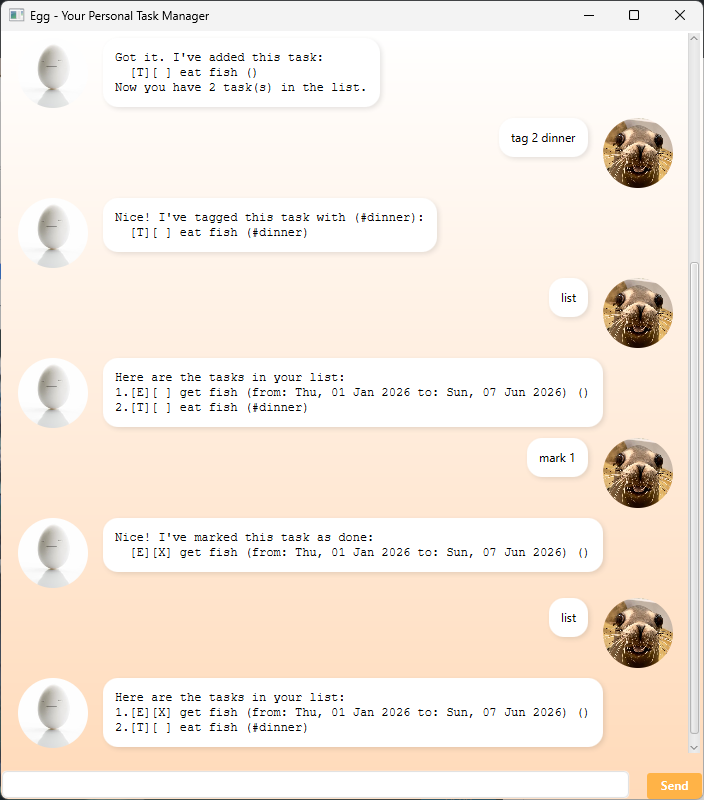

# Egg User Guide

Egg is a lightweight, desktop-based task manager that helps you keep your life in order through a simple command-line interface wrapped in a modern, "sunny-side-up" graphical UI.

## Introduction
Egg lives on your desktop to help you track the **Three Ts: Todos, Tasks, and Timelines.** It understands natural language inputs, handles dates with precision, and organizes your data into a scannable, organized list. Whether you're tracking a quick errand or a multi-day event, Egg has you covered.

---

## Adding Todos
Todos are for tasks that can be completed anytime.

**Usage:** `todo <description>`

* **Description:** Any text describing the task.

**Example:** `todo Read "Dune 2"`

**Expected Outcome:**
Egg will confirm the addition and display the added task.

---

## Adding Deadlines
Deadlines are for tasks that need to be completed by a specific date. Egg will track the date and display it clearly with a "by" label.

**Usage:** `deadline <description> /by <yyyy-mm-dd>`

* **Description:** Any text describing the task.
* **Date:** Must follow the ISO format: `yyyy-mm-dd`.

**Example:** `deadline Submit project proposal /by 2026-12-31`

**Expected Outcome:**
Egg will confirm the addition and display the added task.

---

## Adding Events
Events are for tasks that need to be completed within a specific date range. Egg will track the date and display it clearly with "from" and "to" labels.

**Usage:** `deadline <description> /from <yyyy-mm-dd> /to <yyyy-mm-dd>`

* **Description:** Any text describing the task.
* **Date:** Must follow the ISO format: `yyyy-mm-dd`.
* **From/To:** The start date must be earlier than/the same day as the end date.

**Example:** `event Hackathon /from 2026-01-14 /to 2026-02-03`

**Expected Outcome:**
Egg will confirm the addition and display the added task.

---

## Tagging Tasks
Categorize your tasks for better organization. You can add custom, single-word labels to any existing task.

**Usage:** `tag <index> <tag_name>`

* **Index:** The task number shown in the `list` command.
* **Tag Name:** A single word (no spaces) to label the task.

**Example:** `tag 1 urgent`

**Expected Outcome:**
Egg will confirm the addition and display the updated task.

---

## Finding Tasks
Search through your history to find specific entries using keywords. Egg will filter your list to show only relevant matches.

**Usage:** `find <keyword>`

**Example:** `find book`

**Expected Outcome:**
Egg will list all of the task whose description contains the keyword.
